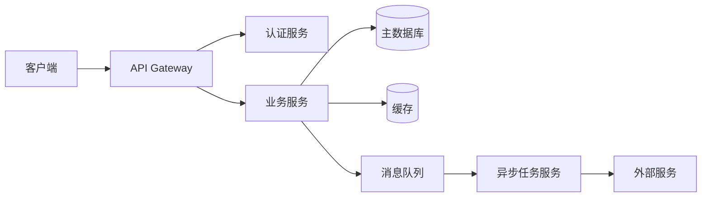

# 数据流设计

## 数据流总览



## 关键数据流程

### 1. 用户注册流程

```
客户端                    API Gateway              认证服务               数据库
  │                          │                       │                     │
  │  POST /auth/register     │                       │                     │
  │─────────────────────────>│                       │                     │
  │                          │  转发请求              │                     │
  │                          │──────────────────────>│                     │
  │                          │                       │  校验输入参数         │
  │                          │                       │  检查邮箱是否已注册    │
  │                          │                       │─────────────────────>│
  │                          │                       │<─────────────────────│
  │                          │                       │  加密密码             │
  │                          │                       │  插入用户记录         │
  │                          │                       │─────────────────────>│
  │                          │                       │  发送欢迎邮件 (异步)  │
  │                          │                       │──────────────────────> 消息队列
  │                          │  201 Created          │                     │
  │                          │<──────────────────────│                     │
  │  注册成功                 │                       │                     │
  │<─────────────────────────│                       │                     │
```

### 2. 用户登录流程

```
客户端                    API Gateway              认证服务               缓存(Redis)
  │                          │                       │                     │
  │  POST /auth/login        │                       │                     │
  │─────────────────────────>│                       │                     │
  │                          │──────────────────────>│                     │
  │                          │                       │  验证邮箱/密码        │
  │                          │                       │  生成 JWT Token      │
  │                          │                       │  缓存 Token ────────>│
  │                          │                       │  返回 Token + 用户信息│
  │                          │<──────────────────────│                     │
  │  返回 Token + 用户信息    │                       │                     │
  │<─────────────────────────│                       │                     │
```

### 3. 订单创建流程

```
客户端                    API Gateway              业务服务              数据库
  │                          │                       │                     │
  │  POST /orders            │                       │                     │
  │─────────────────────────>│                       │                     │
  │                          │  JWT 验证              │                     │
  │                          │──────────────────────>│                     │
  │                          │                       │  校验库存             │
  │                          │                       │─────────────────────>│
  │                          │                       │<─────────────────────│
  │                          │                       │  事务开始             │
  │                          │                       │  创建订单             │
  │                          │                       │  扣减库存             │
  │                          │                       │  事务提交             │
  │                          │                       │─────────────────────>│
  │                          │                       │  发送订单通知 (异步)  │
  │                          │<──────────────────────│                     │
  │  订单创建成功             │                       │                     │
  │<─────────────────────────│                       │                     │
```

## 异步处理机制

| 场景 | 触发事件 | 处理方式 | 失败重试 |
|------|---------|---------|---------|
| 发送邮件 | 用户注册 | 消息队列 → 邮件服务 | 3 次 |
| 订单通知 | 订单状态变更 | 消息队列 → 通知服务 | 5 次 |
| 数据统计 | 定时任务 | Cron Job | 手动修复 |
| 缓存刷新 | 数据更新 | 事件驱动 | 自动重试 |
