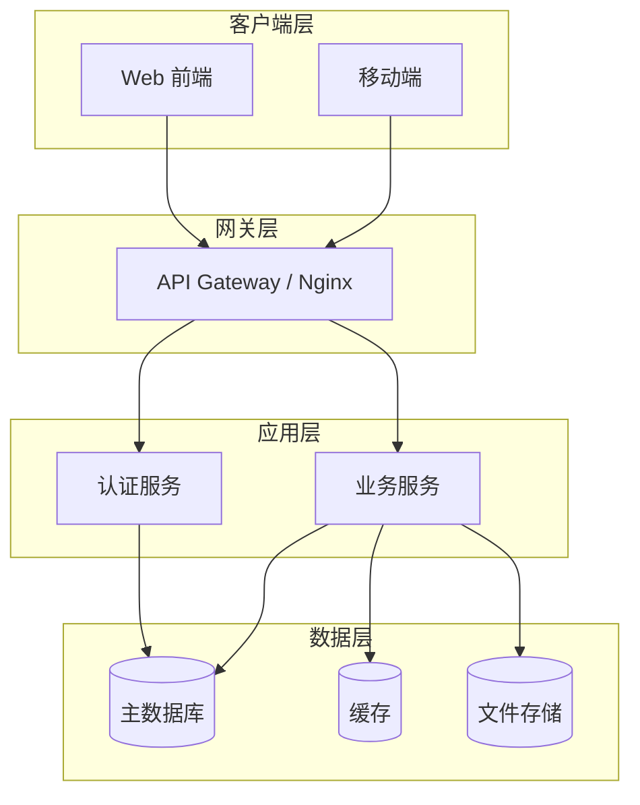

# 系统架构

## 架构概览

> 描述系统的整体架构风格（单体、微服务、分层架构等）。

**架构风格**：[单体 / 微服务 / 分层架构]

**核心设计思想**：[简述架构的核心设计理念]

## 架构图

> 使用 Mermaid 描述系统架构图。

## 模块说明

| 模块 | 职责 | 对外接口 |
|------|------|---------|
| [模块 1] | [职责描述] | [API / 消息队列 / ...] |
| [模块 2] | [职责描述] | [API / 消息队列 / ...] |

## 关键设计决策

| 决策 | 方案 | 理由 |
|------|------|------|
| [决策点 1] | [方案] | [理由] |
| [决策点 2] | [方案] | [理由] |

## 通信方式

| 场景 | 方式 | 说明 |
|------|------|------|
| 同步调用 | [REST / gRPC / GraphQL] | [说明] |
| 异步通信 | [消息队列 / 事件总线] | [说明] |
| 数据同步 | [CDC / 定时任务] | [说明] |
