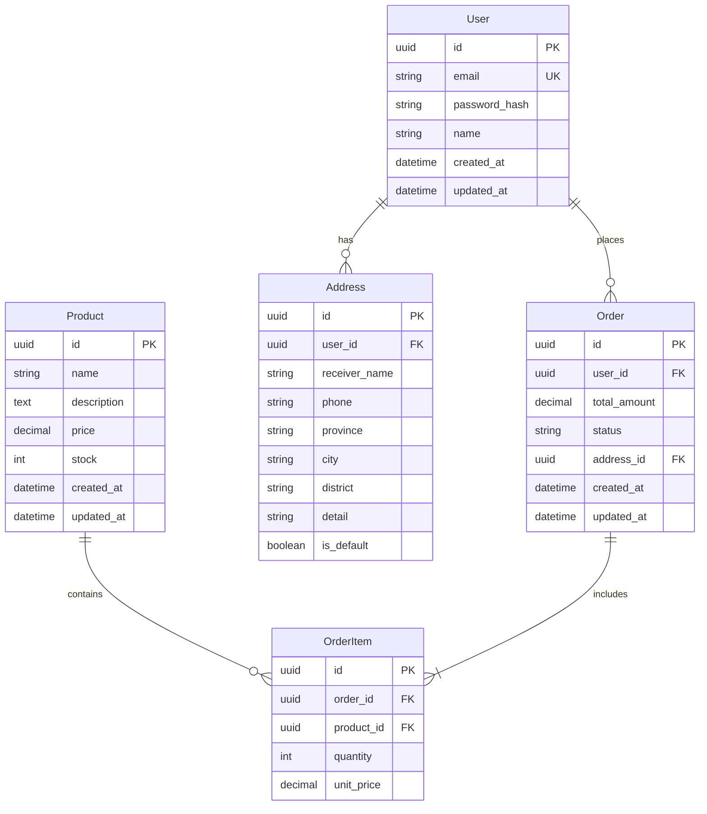

# 实体关系图 (ER Diagram)

## ER 图

## 关系说明

| 关系 | 类型 | 说明 |
|------|------|------|
| User → Order | 1:N | 一个用户可以有多个订单 |
| User → Address | 1:N | 一个用户可以有多个收货地址 |
| Order → OrderItem | 1:N | 一个订单包含多个商品项 |
| Product → OrderItem | 1:N | 一个商品可以出现在多个订单项中 |

## 索引设计

| 表 | 索引字段 | 类型 | 说明 |
|----|---------|------|------|
| User | email | UNIQUE | 登录时查找 |
| Order | user_id, status | COMPOSITE | 查询用户订单列表 |
| Order | created_at | BTREE | 按时间排序 |
| Product | name | FULLTEXT | 商品搜索 |
