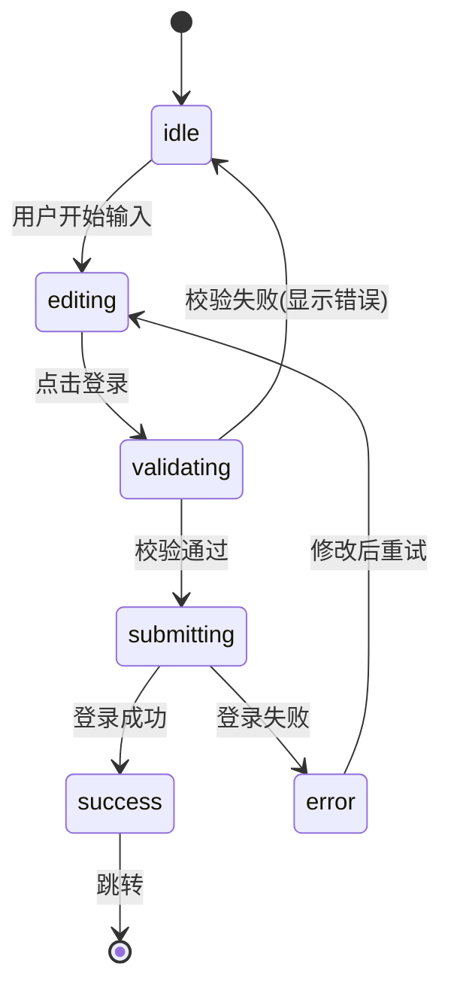
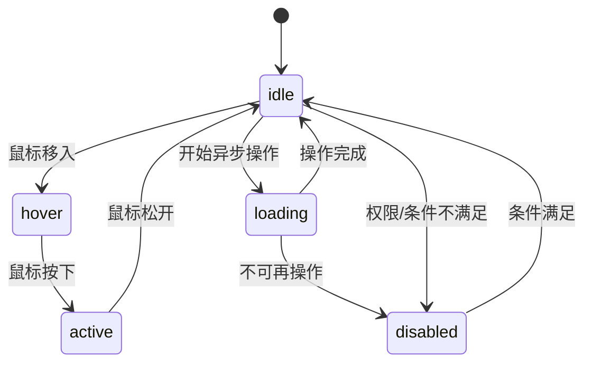
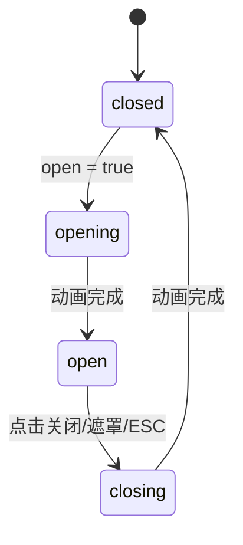
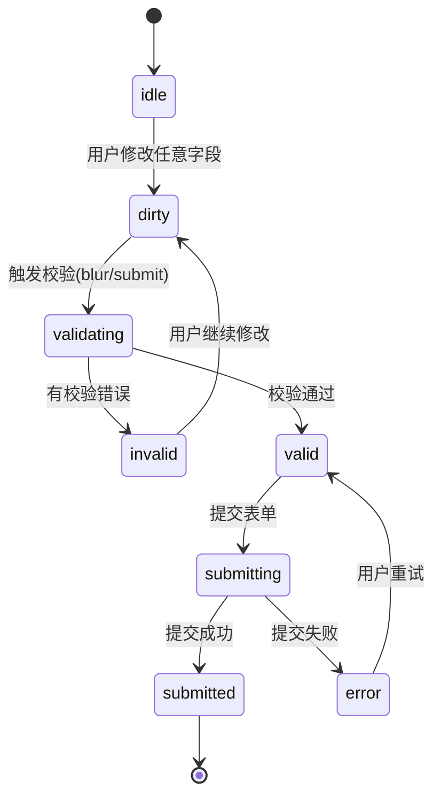

# 组件状态机

## LoginForm 登录表单状态机

**状态说明：**

| 状态 | 描述 | UI 表现 |
|------|------|--------|
| `idle` | 初始空白状态 | 表单空白，按钮可用 |
| `editing` | 用户正在输入 | 显示输入内容，按钮可用 |
| `validating` | 前端校验中 | 显示错误提示（如有） |
| `submitting` | 请求中 | 按钮显示 loading，禁用输入 |
| `success` | 登录成功 | 短暂提示后跳转 |
| `error` | 登录失败 | 显示服务端错误信息 |

---

## Button 按钮状态机

---

## Modal 弹窗状态机

---

## Form 表单状态机

